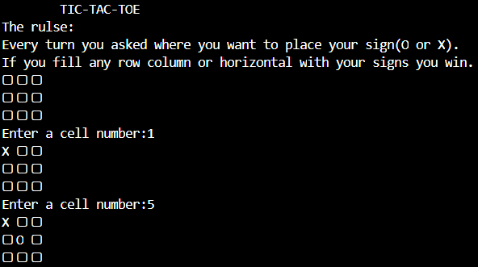

# tic-tac-toe


It is my personal take on classic tic-tac-toe game made with Rust programming lenguage.

## Instalation
To install the programm you nedd to clone the repository
```bash
git clone https://github.com/Padrition/tic-tac-toe.git
```

## Usage 
* To run this programm you have to have a [rust compiler](https://www.rust-lang.org/learn/get-started).

cd into the project folder 
```
cd tic-tac-toe
```

run the program with 
```
cargo run
```
